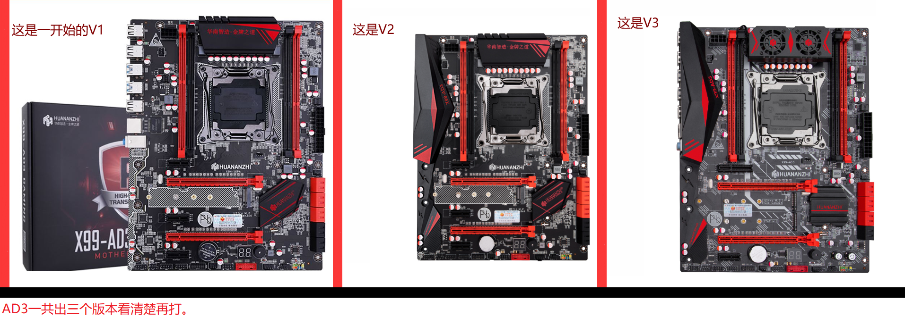
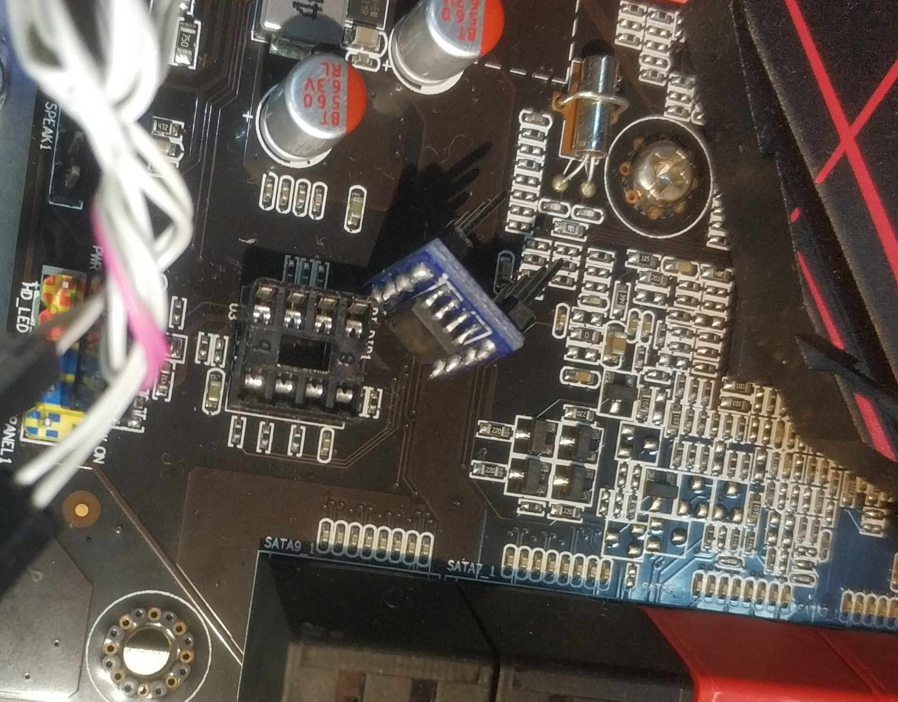

# huananzhi-x99-ad3-bios
Huananzhi X99-AD3 BIOS Turbo Boost Unlock

This repo contains some research on the Huananzhi X99-AD3 motherboard BIOS and Turbo Boost unlock.

## Version issue
Firstly, this link (https://www.bilibili.com/video/av50589090) says there are three versions of this motherboard. He had made the following picture in his mod zip file. 

But this link (https://github.com/ThinkPadThink/Guide2011-3) suggested there are only two versions. 

I have two X99-AD3 motherboard. One without cover at the left side and no fans, when it boot there is no beep sound, let's assume it's version v1 (but its capacitor's looks like the v2 not the v1). One with the cover at the left side but no fans, when it boot it will make a few beeps, let's assume it's version v2. 

I have tried interchanged the bios chip and they both boot ok. So I suspect v1 and v2's bios are the same. But v1 still no beeps and v2 still beeps. So maybe the beeps are controlled by EC, and they have different EC firmware? (If someone knows how to dump and flash the EC firmware please file an issue).

## Tools needed to flash the bios chip

I have tried to use CH341 programmer and a clip to read the bios chip onboard but it doesn't work. So it appears we have to use hot air to sold the chip off and then sold it back.

It's suggested to use these two tools to convert the SOP8 to DIP8 to make it easier to reflash.  
https://www.aliexpress.com/item/32822549802.html 8 Pins DIP DIP8 IC Sockets Adaptor Solder Type 8PIN IC Connector  
https://www.aliexpress.com/item/1091270028.html  SOP8 turn DIP8 / SOIC8 to DIP8 IC adapter Socket PB FREE with Pin Header

## Original BIOS dump

Currently I have seen three versions of the original BIOS. These are the bios chip dumps.  
[2.17.1249-03-10-2019.bin](2.17.1249-03-10-2019.bin) BIOS version 2.17.1249 BIOS date 03/10/2019  
[2.18.1263-12-06-2019.bin](2.18.1263-12-06-2019.bin) BIOS version 2.18.1263 BIOS date 12/06/2019  
[2.18.1263-23-11-2019.bin](2.18.1263-23-11-2019.bin) BIOS version 2.18.1263 BIOS date 23/11/2019  
It appears the last file is the latest, so the following mod are based on this file. 

## Modified BIOS

### Upgraded BIOS for normal usage
Firstly I have used ifdtool to unlock the IFD region and use me_cleaner to remove the intel ME.  
Then I use UBU tool to update some drivers:  
Update EFI Intel RST for SATA and OROM Intel RST for SATA from 14.8.0.2377 to 14.8.2.2397.  
Update OROM Intel RSTe for sSATA from 4.7.0.1014 to 5.5.5.1005.  
Update OROM Realtek Boot Agent GE from 2.66 to 2.67.  
Update all microcode to the latest.  
Now it's the stock bios with new drivers and the resulted file is: [huanan-x99-me-cleaned-sataupdated-microcodeupdated.bin](huanan-x99-me-cleaned-sataupdated-microcodeupdated.bin)

### Unlocked Turbo Boost BIOS for performance
Next I followed this tutorial  (http://www.miyconst.com/Blog/View/2081/xeon-e5-2600-v3-turbo-boost-unlock) to delete the microcode, and inject Xeon E5-2600 V3 Turbo Boost Unlock FFS drivers to the BIOS. Then using disabled C6 state and disabled BIOS locked down and unlocked all menu.

I made two versions:  
[huanan-x99-me-cleaned-microcoderemoved-v3payne0-c6disabled-unlockallmenu.bin](huanan-x99-me-cleaned-microcoderemoved-v3payne0-c6disabled-unlockallmenu.bin) This one has no undervolt.  
[huanan-x99-me-cleaned-microcoderemoved-v3payne50-c6disabled-unlockallmenu.bin](huanan-x99-me-cleaned-microcoderemoved-v3payne50-c6disabled-unlockallmenu.bin) This one has 50 CPU mv and 50 mv RAM undervolt.  

Note: All these files are BIOS chip files that works with external programmer (like CH341). I haven't tried or compared the difference between the dump using external programmer or through internal tools like fptw64.exe. But it maybe work as well.