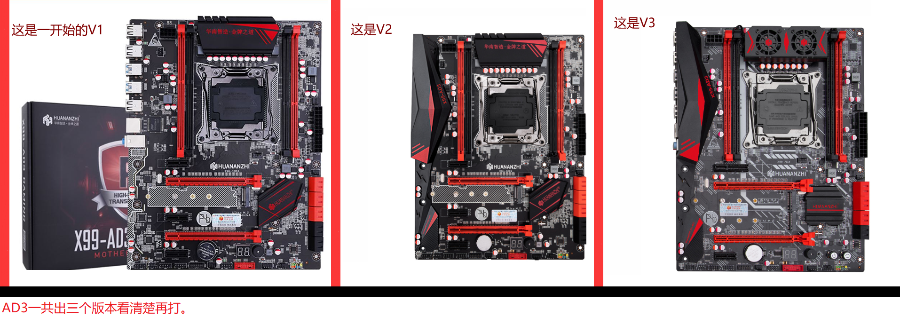
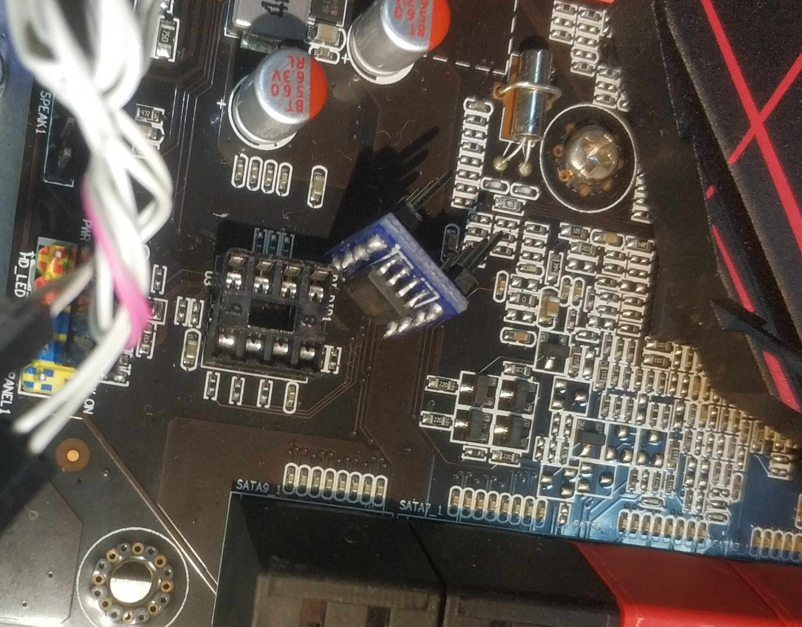

# huananzhi-x99-ad3-bios
Huananzhi X99-AD3 BIOS Turbo Boost Unlock

This repo contains some research on the Huananzhi X99-AD3 motherboard BIOS and Turbo Boost unlock.

华南金牌X99-AD3 BIOS Turbo Boost鸡血补丁

## Version issue
Firstly, this link (https://www.bilibili.com/video/av50589090) says there are three versions of this motherboard. He had made the following picture in his mod zip file. 

But this link (https://github.com/ThinkPadThink/Guide2011-3) suggested there are only two versions. We assume the V1 and V2 bios are the same, while V3 is another one.  

首先，此链接(https://www.bilibili.com/video/av50589090)展示此主板有三个版本。但是这里的链接(https://github.com/ThinkPadThink/Guide2011-3)显示只有两个版本。我们认为V1和V2主板的BIOS相同只有带不带马甲的区别，而V3主板是另一个。

## Tools needed to flash the bios chip

I have tried to use CH341 programmer and a clip to read the bios chip onboard but it doesn't work. So it appears we have to use hot air to sold the chip off and then sold it back.

It's suggested to use these two tools to convert the SOP8 to DIP8 to make it easier to reflash.  
https://www.aliexpress.com/item/32822549802.html 8 Pins DIP DIP8 IC Sockets Adaptor Solder Type 8PIN IC Connector  
https://www.aliexpress.com/item/1091270028.html  SOP8 turn DIP8 / SOIC8 to DIP8 IC adapter Socket PB FREE with Pin Header

  

我试过用CH341编程器和夹子读BIOS芯片，但是不管用。因此，建议用热风枪吹下芯片，然后使用这下面这两种转接座将SOP8转换为DIP8，以使其易于读写。

## Original BIOS dump

Currently I have seen three versions of the original BIOS. These are the bios chip dumps.  
[original-bios/2.17.1249-03-10-2019.bin](original-bios/2.17.1249-03-10-2019.bin) BIOS version 2.17.1249 BIOS date 03/10/2019  
[original-bios/2.18.1263-12-06-2019.bin](original-bios/2.18.1263-12-06-2019.bin) BIOS version 2.18.1263 BIOS date 12/06/2019  
[original-bios/2.18.1263-23-11-2019.bin](original-bios/2.18.1263-23-11-2019.bin) BIOS version 2.18.1263 BIOS date 23/11/2019  
It appears the last file is the latest, so the following mod are based on this latest file.  

目前，我见过的原版BIOS有三个版本（在`original-bios`文件夹里）。看来最后一个文件是最新的，因此下面的mod基于该文件。

## Modified BIOS

### Upgraded BIOS for normal usage
Firstly I have used ifdtool to unlock the IFD region and use me_cleaner to remove the intel ME.  
Then I use UBU tool to update some drivers:  
Update EFI Intel RST for SATA and OROM Intel RST for SATA from 14.8.0.2377 to 14.8.2.2397.  
Update OROM Intel RSTe for sSATA from 4.7.0.1014 to 5.5.5.1005.  
Update OROM Realtek Boot Agent GE from 2.66 to 2.67.  
Update all microcode to the latest.  
Now it's the stock bios with new drivers and the resulted file is:  
[mod-bios/huanan-x99-me-cleaned-sataupdated-microcodeupdated.bin](mod-bios/huanan-x99-me-cleaned-sataupdated-microcodeupdated.bin)

首先，我使用了ifdtool来解锁IFD区域，并使用me_cleaner删除了Intel ME。
然后，我使用UBU工具更新一些驱动程序：
将SATA和OROM SATA的EFI Intel RST从14.8.0.2377更新到14.8.2.2397。
将sSATA的OROM Intel RSTe从4.7.0.1014更新到5.5.5.1005。
将OROM Realtek Boot Agent GE从2.66更新到2.67。
将所有微码更新为最新的。
现在是带有新驱动程序的原始BIOS，结果文件是：
`mod-bios` 文件夹下的 `huanan-x99-me-cleaned-sataupdated-microcodeupdated.bin`  

### Unlocked Turbo Boost BIOS for performance
Next I followed this tutorial  (http://www.miyconst.com/Blog/View/2081/xeon-e5-2600-v3-turbo-boost-unlock) to delete the microcode, and inject Xeon E5-2600 V3 Turbo Boost Unlock FFS drivers to the BIOS. Then disabled C6 state and disabled BIOS locked down and unlocked all hidden menu.

I made two versions:  
[mod-bios/huanan-x99-me-cleaned-microcoderemoved-v3payne0-c6disabled-unlockallmenu.bin](mod-bios/huanan-x99-me-cleaned-microcoderemoved-v3payne0-c6disabled-unlockallmenu.bin) This one has no undervolt.  
[mod-bios/huanan-x99-me-cleaned-microcoderemoved-v3payne50-c6disabled-unlockallmenu.bin](mod-bios/huanan-x99-me-cleaned-microcoderemoved-v3payne50-c6disabled-unlockallmenu.bin) This one has 50 CPU mv and 50 mv RAM undervolt.  

接下来，我按照这个教程(http://www.miyconst.com/Blog/View/2081/xeon-e5-2600-v3-turbo-boost-unlock) 删除微码，并刷入`鸡血补丁`
然后禁用的C6（可能会导致鸡血补丁有问题），并解锁所有隐藏菜单。做了两个版本，在`mod-bios`文件夹里按需取用：  
`huanan-x99-me-cleaned-microcoderemoved-v3payne0-c6disabled-unlockallmenu.bin` 这个没有压降，如果不稳定用这个  
`huanan-x99-me-cleaned-microcoderemoved-v3payne50-c6disabled-unlockallmenu.bin` 这个有50mv压降，如果一切稳定推荐这个  

Note: All these files are BIOS chip files that works with external programmer (like CH341). I haven't tried or compared the difference between the dump using external programmer or through internal tools like fptw64.exe. But it maybe work as well.  
注意：所有这些文件都是用与编程器（例如CH341）刷写的文件。我没有尝试过诸如fptw64.exe之类的内部工具。但也可能能用。